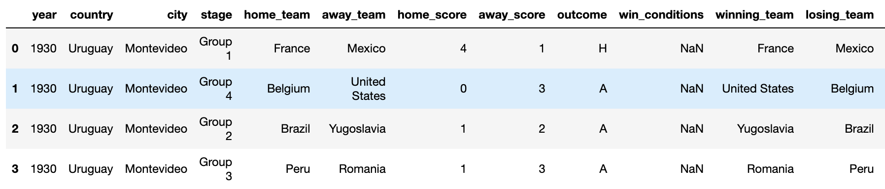
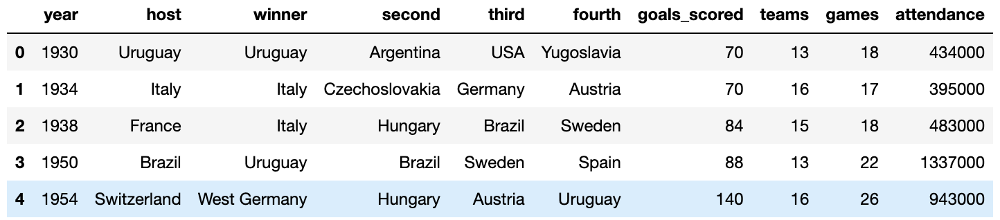
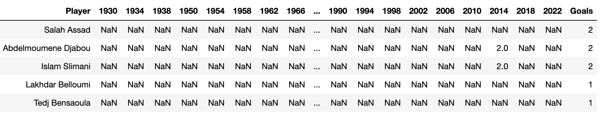
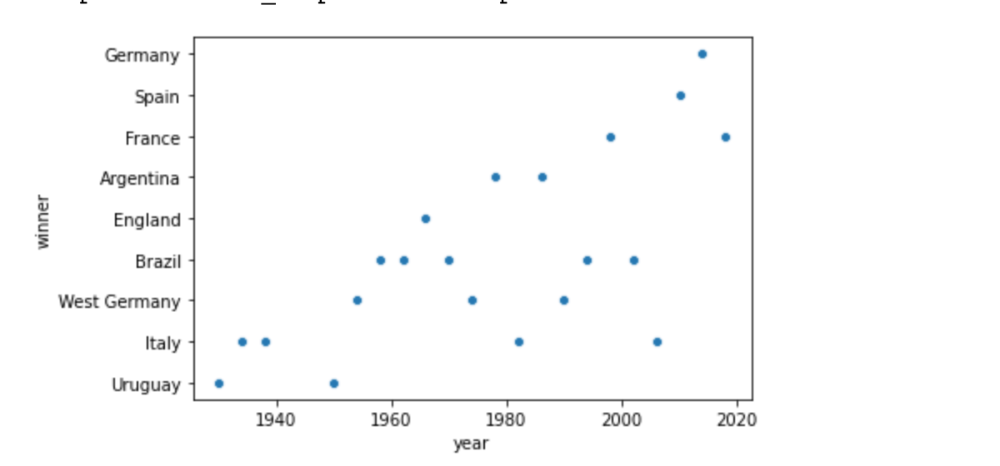

# Viet Hung Bui's individual project report

## Introduction 
The objective of this project is to practice using Jupiter Notebook. The World Cup 2022 is happening in Qarta. It catches an eye of millions people in the world and I am a fan of soccer as well so, I choose this topic for my final project in Data Science Fundamental so that It satisfy my passion and I can improve my skills for this Data Science Fundamental class. 

When I looked at the dataset. It was so many information and I wondered to myself that how can I know the winner of each world cup from the beginning up to now or how can I know the hosting of each world cup. Then I narrow down each table and get the result by the skills that I’ve learn in this class. Besides that, I’ve learn how to visualize the data so that it will be easier to present for other people  

## Selection of data 
The model processing and training are conducted using a Jupiter Notebook.

There are three datasets: 
- wcmatches.csv. This dataset include 15 features such as 'year','country','city',...

Data preview: 

- worldcups.csv. This dataset include 10 features such as 'year','host','winner',....

Data preview: 

- worldcup_goals.csv. This dataset include 3 features such as 'player', 'year','goals'

Data preview: 

The main outcome are extracting and visualization data. The dataset can be found online at 
[kaggle](https://www.kaggle.com/datasets/evangower/fifa-world-cup)[1]

## Methods
- Pandas
  - Read CSV file
  - Extract data 
- Seaborn
  - Scatterplot
- Plotly
  - Scatter
  - Visualization
## Results
- The Winners from 1930 to 2018 World Cup: 

- The Second-place from 1930 to 2018 World Cup: 


## Discussion 
```Warning: ...........................```

## Summary 

## References
[1][World Cup dataset](https://www.kaggle.com/datasets/evangower/fifa-world-cup)
